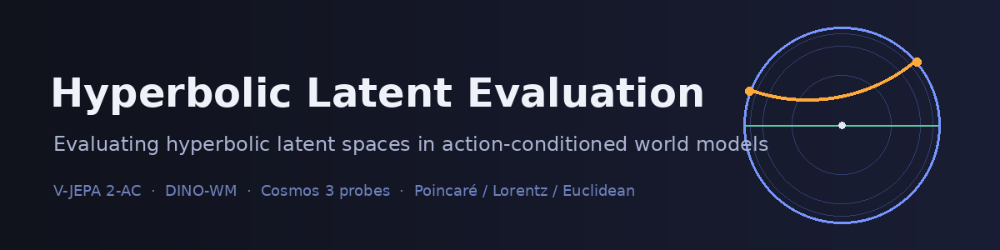

[](https://github.com/ATaylorAerospace/hyperbolic-world-model)

# 🌀 Hyperbolic Latent Evaluation for World Models 📐

[](https://github.com/ATaylorAerospace/hyperbolic-world-model/actions/workflows/ci.yml?query=branch%3Amain)
[](LICENSE)
[](pyproject.toml)
[](https://pytorch.org)
[](https://github.com/geoopt/geoopt)
[](#-verification)
[](docs/methodology.md)

**A research harness that retrains the action-conditioned predictor head of a frozen video world model (V-JEPA 2-AC, with DINO-WM as a lightweight second subject) in Euclidean, Poincaré and Lorentz latent spaces, and measures whether negative curvature buys better rollouts, hierarchy recovery and dimension efficiency, with every distance computed in the geometry of the model that produced it and curvature always swept.**

**Author: A Taylor**

> 🚧 **Status:** Geometry primitives stable · four metrics and four tasks implemented · one-command report · V-JEPA 2-AC head training · 452/452 tests passing.

---

## 🤔 The Problem

Embodied data is tree-shaped in at least three ways. **Embodiment hierarchies** (robot → arm → gripper → primitive skill) branch at every level. **Task decompositions** turn one instruction into sub-goals and sub-goals into primitives. **Branching futures** mean the set of states reachable from one frame grows roughly exponentially with the horizon. A tree with branching factor *b* has *b^h* leaves at depth *h*; the space that stores it needs volume that grows the same way.

Euclidean space does not have that volume. Its balls grow polynomially with radius, so any low-distortion embedding of a tree needs dimension that grows with the tree (Bourgain-type lower bounds). A world model with a Euclidean latent therefore has two bad options: crush distinct futures together, or spend latent dimensions to keep them apart. Either shows up as long-horizon rollout error, poor hierarchy recovery, and a steep dimension-versus-performance curve.

Hyperbolic space has exponential volume growth and embeds any tree with arbitrarily low distortion in two dimensions (Sarkar, 2011). The question this repository asks is empirical: **does a hyperbolic latent help a frozen video encoder's predictor head, and at which curvature and dimension?** The counter-hypothesis is equally live: the frozen encoder may already linearise the relevant structure and curvature may only add optimisation difficulty. The harness is built so either answer is visible and neither is baked in.

---

## 💡 The Solution

- 🧊 **Freeze** the upstream encoder (the V-JEPA 2-AC ViT-g from Meta's `vjepa2_ac_vit_giant` checkpoint, or DINOv2) so every geometry sees identical features. `FrozenEncoder.assert_frozen` guards every optimiser step and checkpoint; Meta's own predictor from the same checkpoint stays frozen as the reference Euclidean baseline.
- 📐 **Project** encoder latents onto the chosen manifold with a seeded, frozen projection followed by `expmap0`, in geodesic units so a step of norm *r* is a geodesic of length *r* in every geometry, so no geometry can win by collapsing its embedding.
- 🔮 **Predict** the next latent with an action-conditioned head that fuses the state coordinates with an action embedding, proposes a bounded tangent update, transports it to the state and follows the geodesic; loss is squared geodesic distance. The Euclidean head is the same network with `+` in place of `expmap`.
- 🎬 **Generate** controlled branching trajectories with NVIDIA Cosmos 3 Nano (start frame + action sequence → video, cosmos-framework `forward_dynamics` mode), inference only, seeded per branch and recorded in a manifest; Cosmos is a data generator and probe target, never a subject.
- 🔬 **Probe** the delta-hyperbolicity of V-JEPA 2, DINOv2 and Cosmos 3 tokenizer latents, independent of any head we train.
- 🎛️ **Sweep** curvature × latent dimension × seed for both hyperbolic models via Hydra multirun. Curvature is never a fixed constant.
- 📏 **Measure** rollout error, distortion, mAP and dimension efficiency in each model's *native* geometry via a single `Manifold` interface.
- 📊 **Report** every table and curvature-sweep figure by regenerating them from `outputs/` with one command (`scripts/make_report.sh`), never by hand; the same `outputs/` gives byte-identical files.

---

## 🏛️ Architecture

```text
 ┌──────────────────────────┐        ┌──────────────────────────────┐        ┌──────────────────────────────┐
 │  NVIDIA Cosmos 3 Nano    │        │  Frozen encoder              │        │  Metrics (native geometry)   │
 │  (inference only)        │        │  V-JEPA 2-AC ViT-g (primary) │        │                              │
 │                          │ video  │  DINOv2 base     (secondary) │        │  geodesic_error   ─┐         │
 │  start frame + actions ──┼───────▶│                              │        │  gromov_hyperb.    │         │
 │  ──▶ video rollouts      │        │  frames (B,T,C,H,W)          │        │  distortion / mAP  ├──▶ 📊   │
 │                          │        │     ──▶ latents (B,T,D)      │        │  dimension_effic.  │  report │
 │  tokenizer latents ──────┼───┐    └──────────────┬───────────────┘        │                   ─┘         │
 │  (δ-hyperbolicity probe) │   │                   │ z_t  (D-dim, Euclidean coords)                        │
 └──────────────────────────┘   │                   │                        └──────────────▲───────────────┘
                                │   ═══════════════ ▼ ═══ GEOMETRY BOUNDARY ═══════════════│═══════════════
                                │   ║ everything below lives on a Manifold; distances    ║ │
                                │   ║ never cross this line in Euclidean coordinates      ║ │
                                │   ═══════════════════════════════════════════════════════│═══════════════
                                │        frozen seeded projection + expmap0               │
                                │              ┌────────────┴────────────┐                │
                                │              ▼                         ▼                │
                                │   ┌────────────────────┐   ┌────────────────────────┐   │
                                │   │ EuclideanHead      │   │ HyperbolicHead         │   │
                                │   │ K = 0              │   │ Poincaré | Lorentz     │   │
                                │   │ s' = s + MLP(s,a)  │   │ K ∈ sweep (< 0)        │   │
                                │   │ loss: |s'-s*|²     │   │ s' = exp_s(P₀→s MLP)   │   │
                                │   └─────────┬──────────┘   │ loss: d_K(s', s*)²     │   │
                                │             │              └───────────┬────────────┘   │
                                │             └──────────────┬───────────┘                │
                                │                            │ predicted latents + manifold│
                                └────────────────────────────┴────────────────────────────┘
```

The geometry boundary is labelled like a trust boundary on purpose: code above it (encoders, data) knows nothing about curvature; code below it never computes a Euclidean norm on manifold coordinates. Crossing the boundary happens in exactly one place, `ActionConditionedPredictor.embed`.

```text
                    Manifold (geometry/base.py)  ── the only abstraction heads, metrics and tasks import
                    ┌─────────────────────────────────────────────────────────────────┐
                    │ expmap(x, u)   logmap(x, y)   dist(x, y)   proj(x)   ptransp(x, y, u) │
                    │ + derived: expmap0, logmap0, sqdist, dist0, geodesic, pairwise_dist   │
                    └───────────┬───────────────────────┬────────────────────────┬────────┘
                                │                       │                        │
                    ┌───────────▼─────────┐  ┌──────────▼───────────┐  ┌─────────▼──────────┐
                    │ Euclidean  (K = 0)  │  │ PoincareBall (K < 0) │  │ Lorentz   (K < 0)  │
                    │ x + u, y - x, |·|   │  │ Möbius ⊕, artanh,    │  │ Minkowski ⟨·,·⟩_L, │
                    │                     │  │ boundary clipping    │  │ arcosh, hyperboloid│
                    └─────────────────────┘  └──────────────────────┘  └────────────────────┘
                                              isometric to each other: tested to 1e-9
```

---

## 🧪 The Three Models

| Model | Role | Weights | License | Modified |
|---|---|---|---|---|
| NVIDIA Cosmos 3 | Action-conditioned trajectory generator (start frame + actions → video, `forward_dynamics` mode) and vision-VAE latent probe target for δ-hyperbolicity; never fine-tuned, generation quality never reported | `nvidia/Cosmos3-Nano` via NVIDIA's cosmos-framework, downloaded by the user | OpenMDW 1.1 | No, frozen |
| V-JEPA 2-AC | Primary subject: the frozen ViT-g/16 encoder from the action-conditioned checkpoint feeds every head; our predictor heads are trained from scratch in each geometry; Meta's bundled predictor is kept frozen as the reference Euclidean baseline | `vjepa2_ac_vit_giant` via `torch.hub` (`vjepa2-ac-vitg.pt`), downloaded by the user | MIT (code) | Predictor head only |
| DINO-WM | Secondary lightweight subject: frozen DINOv2 per-frame encoder with the same retrained heads | `facebook/dinov2-base`, downloaded by the user | Apache 2.0 | Predictor head only |

---

## 📏 Metrics

| Metric | What it measures | Geometry-aware | Module |
|---|---|---|---|
| Geodesic rollout error | Open-loop prediction error vs horizon (mean, median or unreduced), plus a "nothing moves" static baseline for normalisation | Yes: `manifold.dist` of the head's own geometry; anything that is not a `Manifold` raises `TypeError`, and the module's AST is tested to call no other distance | `metrics/geodesic_error.py` |
| Normalised geodesic error | Error divided by the distance the true latent travelled, per sample or as a per-horizon ratio of batch means; equals 1 for a static predictor in every geometry, so it is comparable across curvatures | Yes | `metrics/geodesic_error.py` |
| Gromov δ-hyperbolicity | How tree-like a latent point cloud is (0 for trees), via Gromov products with subsampling; also diameter-normalised | Yes: pairwise distances from any `Manifold` | `metrics/gromov_hyperbolicity.py` |
| Average distortion | Scale-fitted relative error between manifold distances and tree hop counts | Yes | `metrics/distortion.py` |
| mAP | Precision of retrieving true tree neighbours by manifold distance | Yes | `metrics/distortion.py` |
| Dimension efficiency | Metric-vs-latent-dimension curves (seeds averaged), area under curve on a log₂ axis, dimension needed to reach a threshold in either direction, one efficiency table per metric | Consumes the above | `metrics/dimension_efficiency.py` |

---

## 🗺️ Tasks

| Task | Hypothesis tested | Data source | Falsified if |
|---|---|---|---|
| Latent rollout (`tasks/latent_rollout.py`) | At equal dimension the best swept curvature gives lower normalised geodesic error than Euclidean at horizons > 1 | DROID, Cosmos 3 rollouts, synthetic (CI) | No curvature beats Euclidean at any horizon > 1 by more than one seed std, at any dimension |
| Hierarchy reconstruction (`tasks/hierarchy_reconstruction.py`) | Per-trajectory latents (Fréchet mean over time, tree nodes as Fréchet means of their subtrees) recover embodiment > task > primitive with lower distortion and higher mAP, and `dist0` tracks depth (Spearman); bootstrap std over trajectories reported | DROID metadata (synthetic tree in CI) | Best curvature does not improve both distortion and mAP beyond seed std, or depth correlation is not positive |
| Long-horizon consistency (`tasks/long_horizon_consistency.py`) | Geodesic divergence between the rollouts of two branches sharing a start frame tracks the frozen encoder's divergence of the generated frames (Spearman, pooled and per horizon) with higher correlation and saturates later in hyperbolic space; embedded-latent and pixel divergence reported as controls | Cosmos-generated branches (`Cosmos3TrajectoryDataset.branch_pairs`), synthetic branches (`data.n_branches`, CI) | Correlation is not higher or saturation not later for the best curvature |
| Compositional generalisation (`tasks/compositional_generalization.py`) | The unseen-minus-seen normalised error gap on held-out (embodiment, primitive) pairs is smaller in hyperbolic space; the trainer excludes the held-out pairs from the training set | DROID, Cosmos-generated or synthetic data with `holdout_combinations` (`split_by_combination`, or the item metadata) | Gap is not smaller, or is smaller only because seen error got worse |

---

## 🛡️ Experimental Guarantees

> **Rule 1: distances are computed in the model's native geometry.** A Euclidean head is scored with Euclidean distance, a Poincaré head with the Poincaré geodesic at its trained curvature, a Lorentz head with the hyperboloid geodesic. No metric maps one model's latents into another's space. Every metric takes a `Manifold` and calls `manifold.dist`; there is no Euclidean fallback path. Every `TaskResult` records `geometry` and `curvature` next to its numbers.
> *Enforced by* `tests/test_smoke_experiment.py::test_smoke_runs_end_to_end[poincare|lorentz|euclidean]` (asserts the recorded geometry matches the manifold that produced the metrics) and `tests/geometry/test_lorentz.py::test_isometry_to_poincare_ball` (the two hyperbolic geometries agree with each other to 1e-9, so "native" is not "arbitrary").
>
> **Rule 2: curvature is swept, never fixed.** Hyperbolic results come only from `configs/experiments/poincare_sweep.yaml` and `lorentz_sweep.yaml`, which cross `curvature ∈ {-0.1, -0.25, -0.5, -1.0, -2.0, -4.0}` with latent dimension and seed. Tables show the whole curve. The `-1.0` default in `configs/geometry/*.yaml` exists only so single debug runs have a value.
> *Enforced by* `tests/test_smoke_experiment.py::test_smoke_config_is_tiny_and_cpu` (curvature is read from config, never hard-coded) and `tests/geometry/test_base.py::test_registry_covers_every_case_and_build_manifold_accepts_both_keys` (the manifold is built from the config value); the sweep grids live in version-controlled YAML.
>
> **Invariant: the encoder is frozen.** `build_encoder` refuses `encoder.frozen: false`. `FrozenEncoder.assert_frozen` runs before the first optimiser step and before every checkpoint write. Only `predictor.state_dict()` is ever saved.
> *Enforced by* `tests/test_smoke_experiment.py::test_encoder_stays_frozen`.

---

## 🔧 Configuration

Hydra config groups (root: `configs/config.yaml`; select with `group=option`, run an experiment with `experiments=<name>`):

| Group | Options | Default | Notes |
|---|---|---|---|
| `geometry` | `euclidean`, `poincare`, `lorentz` | `euclidean` | `curvature` is the sectional curvature K; `-1.0` in the hyperbolic files is a placeholder for sweeps |
| `models` | `vjepa2_ac`, `dino_wm`, `synthetic` | `vjepa2_ac` | `encoder.frozen` must be `true`; `head.type` is `euclidean` or `hyperbolic`; `head.latent_dim` is swept |
| `data` | `droid`, `cosmos3_generated`, `synthetic` | `droid` | Roots resolve from `DATA_ROOT` |
| `tasks` | `latent_rollout`, `hierarchy_reconstruction`, `long_horizon_consistency`, `compositional_generalization`, `all` | `latent_rollout` | Each option is a list of task configs |
| `experiments` | `smoke`, `baseline_euclidean`, `poincare_sweep`, `lorentz_sweep` | none | `_global_` packages that override the groups above; sweeps set `hydra.mode: MULTIRUN` |

Environment variables (copy `.env.example` to `.env`):

| Variable | Default | Effect |
|---|---|---|
| `HF_TOKEN` | unset | Authenticates Hugging Face downloads; required for the gated Cosmos 3 Nano weights |
| `WANDB_API_KEY` | unset | Enables Weights & Biases logging; JSON/CSV outputs are always written regardless |
| `DATA_ROOT` | `data` | Root for DROID shards, Cosmos 3 prompts/rollouts/latents |
| `CKPT_ROOT` | `checkpoints` | Root for downloaded encoder weights and trained predictor heads |

---

## 📁 Repository Layout

```text
.
├── README.md                          # this file; regenerated at the end of every phase
├── LICENSE                            # PolyForm Noncommercial 1.0.0, © 2026 A Taylor; commercial licences on request
├── THIRD_PARTY_LICENSES.md            # upstream code and weight licences; nothing redistributed
├── CONTRIBUTING.md                    # ground rules: Manifold-only geometry, frozen encoders, swept curvature
├── pyproject.toml                     # uv-compatible metadata, ruff and pytest config
├── uv.lock                            # generated by `uv lock`; pins every dependency
├── .gitignore                         # Python, data/, checkpoints/, outputs/, .env, wandb/
├── .env.example                       # HF_TOKEN, WANDB_API_KEY, DATA_ROOT, CKPT_ROOT
├── .github/workflows/ci.yml           # ruff, pytest on geometry/, metrics/, tasks/ and reporting/ (CPU), one smoke benchmark
├── configs/
│   ├── config.yaml                    # Hydra root: defaults list, output_dir pattern, training block
│   ├── geometry/                      # euclidean.yaml, poincare.yaml (K swept), lorentz.yaml
│   ├── models/                        # vjepa2_ac.yaml, dino_wm.yaml, synthetic.yaml (CI fixture)
│   ├── data/                          # droid.yaml, cosmos3_generated.yaml, synthetic.yaml
│   ├── tasks/                         # one YAML per task plus all.yaml
│   └── experiments/                   # smoke.yaml (CI), baseline_euclidean.yaml, poincare_sweep.yaml, lorentz_sweep.yaml
├── src/hyperbolic_world_model/
│   ├── __init__.py                    # package version
│   ├── geometry/
│   │   ├── base.py                    # Manifold ABC: expmap, logmap, dist, proj, ptransp (+ derived ops)
│   │   ├── euclidean.py               # flat baseline, K = 0
│   │   ├── poincare.py                # Möbius addition, exp/log maps, geodesic distance, boundary clipping
│   │   ├── lorentz.py                 # hyperboloid model, Minkowski inner product, isometry to the ball
│   │   └── utils.py                   # stable artanh/arcosh, norm clipping, per-dtype epsilons
│   ├── models/
│   │   ├── encoders/                  # FrozenEncoder contract + EncoderOutput; vjepa2.py (torch.hub V-JEPA 2-AC + Meta's reference predictor), dino.py, synthetic.py (CI)
│   │   ├── predictors/                # shared architecture (base.py), EuclideanHead, HyperbolicHead (geodesic loss)
│   │   └── registry.py                # build_manifold / build_encoder / build_predictor / build_model from config
│   ├── data/
│   │   ├── droid.py                   # action normalisation + chunking (done); DROID loader (TODO phase 2)
│   │   ├── synthetic.py               # in-memory linear-dynamics trajectories for the smoke run; optional branches sharing a start frame
│   │   ├── hierarchies.py             # embodiment > task > primitive tree, hop-count metric, adjacency
│   │   └── cosmos3/                   # generate.py (Cosmos 3 Nano forward-dynamics rollouts via cosmos-framework), extract_latents.py (vision-VAE latents), dataset.py (manifest loader)
│   ├── metrics/
│   │   ├── geodesic_error.py          # rollout error in native geometry, static baseline, per-horizon and normalised; Manifold only
│   │   ├── gromov_hyperbolicity.py    # δ estimator via Gromov products with subsampling
│   │   ├── distortion.py              # scale-fitted average distortion and mAP
│   │   └── dimension_efficiency.py    # metric-vs-dimension tables and curves, log2 AUC, dimension-to-reach, efficiency table
│   ├── tasks/
│   │   ├── base.py                    # Task ABC, TaskResult (geometry + curvature stamped on every result), batched embedding, Fréchet mean, Spearman
│   │   ├── latent_rollout.py          # open-loop rollout vs static baseline, per-horizon curves
│   │   ├── hierarchy_reconstruction.py       # Fréchet-pooled tree nodes: distortion, mAP, depth correlation, bootstrap std
│   │   ├── long_horizon_consistency.py       # branching rollouts: latent vs encoder/pixel divergence, correlation, saturation
│   │   └── compositional_generalization.py   # held-out (embodiment, primitive) pairs: seen vs unseen rollout error and gap
│   ├── training/
│   │   ├── train_predictor.py         # Hydra entry point; builds tasks first; trains the head only (seen combinations when a holdout is set); asserts encoder frozen
│   │   └── riemannian_optim.py        # AdamW, or geoopt RiemannianAdam if any ManifoldParameter exists
│   └── reporting/
│       ├── tables.py                  # collect metrics.json → results, summary (mean ± std), sweep grids, best-vs-Euclidean, dimension efficiency → Markdown
│       ├── curvature_sweep_plots.py   # metric vs curvature, metric vs dimension, every task's curves (matplotlib, headless, deterministic)
│       └── make_report.py             # one command regenerates every table and figure from outputs/
├── scripts/
│   ├── download_weights.sh            # V-JEPA 2-AC via torch.hub, DINOv2 and Cosmos 3 Nano via huggingface_hub; reads HF_TOKEN
│   ├── generate_cosmos3_trajectories.sh   # generate rollouts into $DATA_ROOT/cosmos3_generated, then extract tokenizer latents
│   ├── run_smoke.sh                   # CPU end-to-end run used by CI
│   ├── run_baseline.sh                # Euclidean baseline on DROID
│   ├── run_curvature_sweep.sh         # Poincaré and/or Lorentz multirun sweeps
│   └── make_report.sh                 # wraps reporting/make_report.py
├── tests/
│   ├── conftest.py                    # seeds, float32/float64 fixture
│   ├── geometry/                      # test_base.py (contract over all geometries), test_poincare.py, test_lorentz.py, test_euclidean.py, test_utils.py, test_public_api.py, helpers.py
│   ├── models/                        # test_predictor_heads.py (shapes, identical architecture, isometric twins), test_vjepa2.py (hub loader with fakes)
│   ├── data/                          # test_cosmos3.py (generation pipeline, adapter chunk loop, latents, dataset; all with fakes)
│   ├── metrics/                       # test_geodesic_error.py, test_gromov_hyperbolicity.py, test_distortion.py, test_dimension_efficiency.py
│   ├── tasks/                         # test_base.py (registry, Fréchet mean, Spearman), one file per task, helpers.py (tiny bundles, branching datasets)
│   ├── reporting/                     # test_tables.py, test_make_report.py (every file written, byte-identical rerun), helpers.py (fake outputs/ tree)
│   └── test_smoke_experiment.py       # runs configs/experiments/smoke.yaml on CPU in all three geometries, and all four tasks on branched synthetic data
├── data/README.md                     # expected dataset layout (directory gitignored)
├── checkpoints/README.md              # expected weight layout (directory gitignored)
├── outputs/README.md                  # what every run writes (directory gitignored)
└── docs/
    ├── header.png                     # README header graphic, regenerated by make_header.py
    ├── make_header.py                 # draws header.png with Pillow: the metadata tree in the Poincaré ball, a rollout on the hyperboloid
    ├── methodology.md                 # hypotheses, falsification criteria, the two rules, numerical caveats
    ├── cosmos3_usage.md               # how Cosmos 3 is used and, explicitly, how it is not
    └── reproducibility.md             # seeds, lockfile, one-command reproduction path
```

---

## 🏁 Quick Start

1. **Clone**

   ```bash
   git clone https://github.com/ATaylorAerospace/hyperbolic-world-model
   cd hyperbolic-world-model
   ```

2. **Install** (uv creates `.venv` from the lockfile; add `--index https://download.pytorch.org/whl/cpu` style overrides for a CPU-only torch as CI does)

   ```bash
   uv sync --extra vjepa2  # the extra adds timm, which torch.hub needs to import the V-JEPA 2-AC code
   cp .env.example .env    # fill in HF_TOKEN if you need gated weights
   ```

3. **Download** frozen weights (no datasets are downloaded; nothing is downloaded during install or tests)

   ```bash
   bash scripts/download_weights.sh all      # or: vjepa2 | dinov2 | cosmos3
   ```

4. **Smoke** test the whole pipeline on CPU in seconds (synthetic data, synthetic frozen encoder, Poincaré head)

   ```bash
   uv run pytest -v
   uv run bash scripts/run_smoke.sh
   # all four tasks on CPU: branching synthetic prompts and one held-out (embodiment, primitive) pair
   uv run bash scripts/run_smoke.sh tasks=all data.n_branches=2 'data.holdout_combinations=[[arm_b,grasp]]'
   bash scripts/make_report.sh   # tables and figures for everything under outputs/
   ```

5. **Baseline** the Euclidean head on DROID with all tasks

   ```bash
   bash scripts/run_baseline.sh
   ```

6. **Sweep** curvature × latent dimension × seed for both hyperbolic models

   ```bash
   bash scripts/run_curvature_sweep.sh both
   ```

7. **Report** by regenerating every table and figure from `outputs/`

   ```bash
   bash scripts/make_report.sh
   ```

---

## 🧩 Components

| Module | Role | Key Guarantees | Status |
|---|---|---|---|
| `geometry/base.py` | `Manifold` interface | Single abstraction for heads, metrics, tasks; curvature `c` passed at construction; the full contract runs against every registered geometry in `tests/geometry/test_base.py` | ✅ |
| `geometry/euclidean.py` | Flat baseline | Wraps `geoopt.Euclidean`; identical code path to curved geometries; rejects non-zero curvature | ✅ |
| `geometry/poincare.py` | Poincaré ball | Wraps `geoopt.PoincareBall`; exp/log inverse, metric axioms, gradcheck; float32 agrees with float64 at 0.999 R except ~1% on boundary-to-boundary Möbius distances; float32 round trip holds inside the 4e-3 clip margin | ✅ |
| `geometry/lorentz.py` | Hyperboloid | Wraps `geoopt.Lorentz`; own transport (finite at coincident points) and own isometries (geoopt's assume the unit ball); isometric to the ball to 1e-9 at every curvature; float32 self-distance noise ≤ 2e-3·x₀ | ✅ |
| `geometry/utils.py` | Stable primitives | geoopt's `artanh`/`arcosh` re-exported; per-dtype epsilons; norm clipping | ✅ |
| `tests/geometry/test_public_api.py` | API coverage guard | Fails if any public geometry function, method or constant is not referenced by a geometry test | ✅ |
| `metrics/geodesic_error.py` | Rollout error | Takes a `Manifold` and raises `TypeError` for anything else; the module's AST is tested to call no distance but `manifold.dist`; static "nothing moves" baseline; per-sample and per-horizon normalised error that is exactly 1 for a static predictor on Euclidean, Poincaré (two curvatures) and Lorentz | ✅ |
| `metrics/gromov_hyperbolicity.py` | δ-hyperbolicity | δ = 0 on tree metrics, > 0 on grids; scale covariant; chunked max-min product | ✅ |
| `metrics/distortion.py` | Distortion, mAP | Scale-fitted; 0 distortion / 1.0 mAP on a perfect embedding | ✅ |
| `metrics/dimension_efficiency.py` | Dimension curves | Tidy tables, seed-averaged `DimensionCurve`s, log₂ AUC, dimension-to-reach in either direction, efficiency table consumed by the report | ✅ |
| `models/encoders/vjepa2.py` | V-JEPA 2-AC via torch.hub | Loads `vjepa2_ac_vit_giant` code from hub and Meta's `vjepa2-ac-vitg.pt` from the official URL; encodes each frame as Meta's inference code does (2-frame tubelet, layer-normed tokens); returns patch and pooled embeddings; `assert_frozen` on encoder and reference predictor; refuses partially loaded checkpoints; accepts a local clone path for air-gapped machines; validated against Meta's upstream code at the pinned commit (random init: 1012M-param ViT-g, 256 tokens per 256 px frame, 305M-param reference predictor, all frozen); Meta's weights not yet run (`uv sync --extra vjepa2` provides `timm` for hub) | 🚧 |
| `models/encoders/` | Encoder contract | `EncoderOutput(patch, pooled)`; `train()` is a no-op; synthetic encoder for CI; DINOv2 patch + CLS/mean pooling | ✅ |
| `models/predictors/` | Heads | Identical architecture by construction (same seed gives identical weights; `architecture_signature` equal); action embedding concatenated to state coordinates; geodesic units in every geometry (Poincaré and Lorentz heads are isometric twins); `max_step` and `max_radius` guards shared; `HyperbolicHead(Euclidean)` equals `EuclideanHead` exactly | ✅ |
| `models/registry.py` | Config → objects | Refuses `frozen: false`; checks `embed_dim` against the loaded encoder | ✅ |
| `data/hierarchies.py` | Metadata → tree | Hop-count metric is 0-hyperbolic (used as the δ reference) | ✅ |
| `data/synthetic.py` | CI trajectories | Deterministic, learnable linear dynamics, two-level hierarchy in metadata; `n_branches` groups episodes into prompts sharing a start frame (`branch_pairs`) so all four tasks run on CPU | ✅ |
| `data/droid.py` | DROID | Action stats and chunking done; loader raises `NotImplementedError` with plan | 🚧 |
| `data/cosmos3/generate.py` | Cosmos 3 rollouts | Standalone batch script: start frames + action JSON → `frames.npz`, `meta.json`, optional mp4, `manifest.jsonl`; per-branch deterministic seeds; idempotent; `--dry-run` plan; `Cosmos3Generator` drives cosmos-framework's `forward_dynamics` mode (Cosmos3-Nano, `droid_lerobot` 10-D actions) with one invocation per chunk level, zero padding, per-chunk seeds, autoregressive chaining and stitching so frame t+1 is the result of action t; mp4 via ffmpeg; not run on a real model | 🚧 |
| `data/cosmos3/extract_latents.py` | Tokenizer latents | Cosmos 3 vision-VAE adapter (4x temporal, 16x spatial; pads T to 4n+1, crops to multiples of 16, `[-1, 1]` input, encoder only); mean or flatten pooling to `(T', D)`; float16 npz + meta; manifest updated; idempotent | 🚧 |
| `data/cosmos3/dataset.py` | Generated-trajectory loader | Manifest-driven windows in the shared batch format; bilinear resize; `branches`/`branch_pairs` for long-horizon consistency; `split_by_combination` for compositional generalisation (refuses splits that remove an embodiment or primitive); `latents(idx)`; deterministic train/val/test by prompt hash | ✅ |
| `tasks/base.py` | Task interface | `TaskResult` always carries geometry and curvature; `iter_embedded` streams any dataset through the frozen encoder and the head's embedding (asserts frozen); `frechet_mean` pools on the manifold by Riemannian descent with a backtracking line search (stationary, minimises the squared-distance objective, isometry-invariant between ball and hyperboloid, arithmetic mean in flat space); `spearman` | ✅ |
| `tasks/latent_rollout.py` | Rollout task | Native-geometry error vs horizon with the static baseline; normalised error exactly 1 for a static head in every geometry; `evaluate` over index subsets reused by the compositional task; curves to CSV | ✅ |
| `tasks/hierarchy_reconstruction.py` | Hierarchy task | Trajectories pooled over time and tree nodes over their subtrees by Fréchet mean; distortion, mAP and Spearman(depth, `dist0`) in the head's geometry; bootstrap resampling within leaves for `*_std`; perfect on a perfectly embedded chain; per-depth `dist0` curve | ✅ |
| `tasks/long_horizon_consistency.py` | Branching task | Rollouts of two branches from the shared start latent; geodesic latent divergence vs the frozen encoder's divergence (its own Euclidean space) and pixel RMSE; pooled and per-horizon Spearman; saturation horizon; embedded-latent divergence as a control; requires `branch_pairs()` and checks the start frames match; matches a manual computation | ✅ |
| `tasks/compositional_generalization.py` | Held-out task | Uses the dataset's `split_by_combination` or its metadata with the same safety checks (missing pair, removed embodiment/primitive); seen and unseen rollout summaries, gaps in raw and normalised error; refuses an empty holdout; the trainer excludes the held-out pairs from training | ✅ |
| `training/train_predictor.py` | Hydra entry point | Head-only optimisation; frozen assert before first step and every save; tasks built before training so a bad task config fails fast; trains on the seen combinations when `data.holdout_combinations` is set; geometry, curvature, latent dim, seed and `n_train` in every output; output directories include the seed | ✅ |
| `training/riemannian_optim.py` | Optimiser | Auto-selects `RiemannianAdam` when any `ManifoldParameter` exists | ✅ |
| `reporting/` | Tables and figures | One command (`scripts/make_report.sh`) regenerates: every-run results, summary (mean ± std over seeds), a curvature-sweep grid per swept metric, best-curvature-vs-Euclidean with the one-std rule (needs ≥ 2 seeds), dimension efficiency (log₂ AUC, dimension to reach the flat baseline), figures per swept metric, per dimension curve and per task's curves, plus an index; stale files removed; byte-identical on rerun (tested) | ✅ |

---

## ✅ Verification

```bash
uv run pytest -q
```

```text
=========================== short test summary info ============================
SKIPPED [1] tests/data/test_cosmos3.py:284: needs ffmpeg
452 passed, 1 skipped in 38.10s
```

| Suite | Tests | What it exercises |
|---|---|---|
| `tests/geometry` | 272 | the `Manifold` contract over Euclidean, Poincaré and Lorentz at every swept curvature, float32 and float64 |
| `tests/tasks` | 69 | the task base (batched embedding, Fréchet mean, Spearman) and all four tasks in every geometry |
| `tests/models` | 45 | both predictor heads and the V-JEPA 2-AC loader (with fakes, no download) |
| `tests/metrics` | 29 | geodesic error (Manifold-only, checked on the AST), Gromov δ, distortion and mAP, dimension efficiency |
| `tests/data` | 19 | the Cosmos 3 generation, latent extraction and dataset pipeline, all with fakes |
| `tests/reporting` | 12 | every table and figure of the one-command report, byte-identical on rerun |
| `tests/test_smoke_experiment.py` | 7 | the end-to-end smoke experiment in all three geometries and with all four tasks |

The summary above is the output of a real run; the per-suite counts come from `pytest --collect-only`.

What the tests cover:

- [x] Manifold contract (`tests/geometry/test_base.py`), run over Euclidean, Poincaré at c ∈ {-0.5, -1, -2} and Lorentz at c ∈ {-0.5, -1, -2}, in float32 and float64: exp/log inverse identity on random points and random tangents; distance symmetry, non-negativity, zero self-distance and the triangle inequality on random points; `sqdist`, `dist0` and `pairwise_dist` consistent with `dist`; origin closed forms match the general maps; geodesic endpoints, midpoint and additivity; `proj` idempotent and on-manifold; `proj_tan` idempotent and `logmap` tangent; parallel transport is the identity at a point, reverses the geodesic and preserves lengths; `egrad2rgrad` tangent and equal to geoopt's; tangent-lift round trip; `to_geoopt` returns the matching geoopt manifold usable as a `ManifoldParameter`; `check_point` rejects off-manifold points; outputs keep the input dtype; `build_manifold` accepts `c` or `curvature` and rejects unknown names.
- [x] Poincaré ball (`test_poincare.py`): construction and the float64 geoopt parameter; `lambda_x` closed form; Möbius addition identity, inverse, left cancellation, non-commutativity and agreement with geoopt; gyration is an isometry, trivial at zero and defines transport; transport preserves the conformal norm; closed-form distance from the origin; `gradcheck` against finite differences for `dist`, `expmap`, `logmap`, `expmap0`, `logmap0`, `ptransp`, `dist0`; boundary clipping to `(1 - eps) * radius`; float32 vs float64 at 0.999 of the boundary radius (agreement to 1e-4 off the Möbius path, ~1% on it, everything finite including gradients, float64 round trip to 1e-5) and the float32 round trip inside the clip margin.
- [x] Lorentz hyperboloid (`test_lorentz.py`): construction and the float64 geoopt parameter; Minkowski inner product; points and origin on the hyperboloid; `logmap` tangent with length equal to `dist`; our transport matches geoopt's at distinct points and is finite at coincident points; isometry to the Poincaré ball at every curvature to 1e-9 (points, distances, midpoints); `gradcheck` for the same seven functions; tangent lift; float32 vs float64 at the image of 0.999 of the radius (`dist`/`dist0` to 1e-5, self-distance noise ≤ 2e-3·x₀, `logmap` within 20%, on-manifold and finite) and the documented exponential loss of the float64 round trip with distance.
- [x] Euclidean (`test_euclidean.py`): the same contract reduces to vector arithmetic; geodesics, pairwise distances, `gradcheck`, geoopt equivalent.
- [x] Utilities (`test_utils.py`): per-dtype epsilon tables; `artanh` and `arcosh` match torch inside the domain, stay finite at the boundary and have correct gradients; `safe_norm` never returns zero; `clip_norm` only shrinks and preserves direction.
- [x] API coverage guard (`test_public_api.py`): every public function, method and constant in the geometry package is referenced by a geometry test.
- [x] Predictor heads (`tests/models/test_predictor_heads.py`), over the Euclidean head and the hyperbolic head on Euclidean, Poincaré (c ∈ {-1, -0.5}) and Lorentz manifolds: output shapes of `embed`, `step`, `rollout`, `forward`, `fuse`, `delta` and `coordinates` from random CPU inputs; outputs stay on the manifold with `max_step` and `max_radius` respected even under forced maximal updates; gradients reach every trainable parameter and never the frozen projection; the action conditions the prediction; both heads have identical parameter signatures and identical initial weights for the same seed; steps are measured in geodesic units in every geometry; Poincaré and Lorentz heads with identical weights are isometric twins; `HyperbolicHead(Euclidean)` equals `EuclideanHead` exactly; the embedding is `expmap0` of the frozen orthonormal projection; the registry builds both heads and rejects mismatched geometry.
- [x] V-JEPA 2-AC loader (`tests/models/test_vjepa2.py`, with tiny stand-ins for the hub modules, no download): `torch.hub.load` is called with the `vjepa2_ac_vit_giant` entry, pinned ref and `pretrained=False`; encoder and Meta's reference predictor come back frozen and cannot be switched to training mode; `assert_frozen` catches a thawed parameter in either; `forward` returns patch `(B, T, N, D)` and pooled `(B, T, D)` embeddings, encodes each frame as a 2-frame tubelet and layer-normalises tokens (and does not when `normalize_reps` is off); the reference predictor's frame-causal forward, `predict_next`, autoregressive `rollout` and L1 loss have the expected shapes and reject misaligned inputs; the pretrained path cleans `module.`/`backbone.` prefixes, loads strictly and refuses a checkpoint with missing keys; a local checkout path is loaded with hub's `source="local"`; a missing `timm` produces an actionable error; the registry builds the bundle with the reference predictor attached.
- [x] Cosmos 3 pipeline (`tests/data/test_cosmos3.py`, all with fakes, no model): action-spec parsing and validation (shapes, missing frames, duplicate ids, unsupported formats, prompt text with task fallback); deterministic distinct per-branch seeds; end-to-end generation writes `frames.npz`, `meta.json` and `manifest.jsonl` with shared start frames across branches, is idempotent and reproducible, and takes the batched path when the generator offers one; the CLI's `--dry-run` plan and injected-generator path; `Cosmos3Generator` builds `forward_dynamics` samples with the expected fields (domain, chunk size, image size, fps, view point, prompt, seed, sampler settings), invokes the framework once per chunk level with every active rollout batched, zero-pads the last chunk, seeds each chunk as branch seed plus level, conditions each later chunk on the previous chunk's last frame, tolerates extra output frames and stitches without duplicated or dropped frames; chunk sizes must be multiples of 4; a missing framework or short output gives an actionable error; the ffmpeg helpers fail cleanly without ffmpeg (the lossy round trip runs only where ffmpeg exists, skipped here); latent pooling (mean, flatten), extraction to float16 npz with manifest update, idempotence and the CLI; `Cosmos3TokenizerBackend` pads T to 4n+1, crops to multiples of 16 and feeds a `[-1, 1]` bfloat16 `(1, 3, T, H, W)` tensor; the dataset's windows, shapes, resize, metadata, branch groups and pairs sharing a start frame, compositional split with its safety checks, hierarchy construction, latents access, deterministic splits and config construction.
- [x] Geodesic error (`tests/metrics/test_geodesic_error.py`), over Euclidean, Poincaré (c ∈ {-1, -0.5}) and Lorentz: the error equals `manifold.dist` and differs from the coordinate norm on curved geometries; anything that is not a `Manifold` (`None`, a string, a geoopt manifold, a function) raises `TypeError`; the module's AST calls no `cdist`/`norm`/`vector_norm`/`mse_loss` and only `manifold.dist`; shape and reduction validation; mean/median/unreduced per-horizon reductions; the static baseline accepts `(..., d)` and `(..., 1, d)` contexts and the normalised error (per sample and per horizon) is exactly 1 for a static predictor and 0 for a perfect one; targets that did not move give finite values.
- [x] Dimension efficiency (`tests/metrics/test_dimension_efficiency.py`): sorted long tables with a helpful `KeyError`; `DimensionCurve` validation (lengths, order, uniqueness, positivity); seed averaging in `curves_from_table`; log₂ AUC on known curves (2 for a flat curve over 2, 4, 8); dimension-to-reach in both directions; the efficiency table shows the uniformly better curve reaching the threshold earlier with a smaller AUC and `NaN` for single-dimension curves.
- [x] Gromov δ (`tests/metrics`): exactly 0 on the embodiment > task > primitive tree metric from any base point; positive on L1 and L2 grids; scale covariant; subsampled estimator on point clouds, including a path (δ = 0).
- [x] Distortion and mAP: 0 and 1.0 on a perfectly embedded path graph; scale fitting matters; shape validation; structured beats random on a Poincaré tree embedding.
- [x] Task base (`tests/tasks/test_base.py`): the registry holds exactly the four tasks and `build_task` validates names and kwargs; results are stamped with the bundle's geometry and curvature and serialise; `iter_embedded` yields on-manifold `(B, T, d)` latents with encoder latents, actions, frames, metadata and indices, honours index subsets in order, leaves the head in eval mode and refuses a thawed encoder; the Fréchet mean is the (weighted) arithmetic mean in flat space, and on Poincaré (c ∈ {-1, -2}) and Lorentz (c ∈ {-1, -0.5}) it is stationary (mean log map < 1e-5), beats the naive tangent-space mean and any input point on the squared-distance objective, returns single or repeated points unchanged, maps symmetric points to the origin, corresponds between ball and hyperboloid under the isometry, and validates its inputs; Spearman handles ties, constants (NaN) and length mismatches.
- [x] Latent rollout (`tests/tasks/test_latent_rollout.py`), over all four geometries: metrics and curves in the bundle's geometry with the scalars equal to the curve endpoints; a zero-initialised head has error identical to the static baseline and normalised error exactly 1; `evaluate` on an index subset matches a manual encode → embed → rollout → `geodesic_error` computation; horizon validation and empty subsets raise; prefixed summaries.
- [x] Hierarchy reconstruction (`tests/tasks/test_hierarchy_reconstruction.py`): a perfectly embedded chain scores 0 distortion, 1.0 mAP and Spearman ±1 depending on orientation; subtree membership and Fréchet node embeddings (root = mean of everything, uniform weights = unweighted, empty node raises); bootstrap weights resample within leaves, deterministically per seed; on the synthetic hierarchy in every geometry the task reports 27 nodes, 16 leaves, ranged metrics, `*_std` and the per-depth `dist0` curve; batch size does not change the result; `n_seeds=0` gives NaN spreads; per-trajectory pooling is the Fréchet mean, not a coordinate average; custom levels.
- [x] Long-horizon consistency (`tests/tasks/test_long_horizon_consistency.py`): saturation horizon; `branch_pairs` validation (no method, no pairs); on in-memory branching data in every geometry all four divergence curves are positive with the scalars equal to the curve endpoints and correlations in [-1, 1]; a static head has zero latent divergence and undefined correlation; every curve matches a manual computation for one pair; the horizon is capped by the shortest branch; mismatched start frames raise; constructor validation; the real `Cosmos3TrajectoryDataset` layout (hand-written manifest) drives the task; synthetic `n_branches` prompts share their start frame and drive the task.
- [x] Compositional generalisation (`tests/tasks/test_compositional_generalization.py`): holdout normalisation; metadata split with the missing-pair and removed-embodiment checks; the dataset's own `split_by_combination` is preferred (fake and real Cosmos 3 loader); an empty holdout is refused; in every geometry seen/unseen summaries, gaps, ratio, counts and curves are reported and each subset equals the latent-rollout task restricted to it; `training_subset` drops the held-out episodes; the trainer runs the task end to end on 48 of 64 episodes with the seed recorded, and builds the tasks before training so a bad task config fails before the first epoch.
- [x] Reporting (`tests/reporting`): run collection and the sorted long table; summary mean/std/count over seeds; the curvature × dimension sweep grid; best-curvature-vs-Euclidean picks the minimum or maximum by metric direction, applies the one-std rule, never flags single-seed runs and is NaN without a baseline; dimension efficiency with the Euclidean-at-max-dimension threshold; metric direction and bookkeeping filters; Markdown formatting of NaN, integers and booleans; `make_report` writes every expected table and figure and an index, gives no sweep table or figure to counts or `*_std`, is byte-identical on a second run, removes stale generated files and nothing else, produces only dimension figures without a sweep, still writes a report for an empty `outputs/`, and the CLI prints every path.
- [x] Smoke experiment: `configs/experiments/smoke.yaml` runs end to end on CPU in Poincaré, Lorentz and Euclidean geometry; loss decreases; error grows with horizon; `metrics.json`, curves CSV and resolved config are written with the geometry recorded; with `tasks=all`, `data.n_branches=2` and a held-out pair all four tasks run and write their curves; the encoder cannot be un-frozen; `HyperbolicHead` on the flat manifold equals `EuclideanHead` exactly.

CI runs `ruff check`, `ruff format --check`, `pytest tests/geometry tests/metrics tests/tasks tests/reporting` and `scripts/run_smoke.sh`, all on CPU.

---

## ⚖️ Weights and Licensing

No model weights are included in this repository. Every checkpoint is downloaded by the user from its upstream source under the upstream terms, and none is redistributed:

- **V-JEPA 2-AC** (`vjepa2_ac_vit_giant` via `torch.hub`, weights `vjepa2-ac-vitg.pt` from Meta's official URL): MIT-licensed code; weights per the upstream release. Encoder used frozen; Meta's bundled predictor kept frozen as the reference baseline.
- **DINOv2** (`facebook/dinov2-base`): Apache 2.0. Used frozen.
- **NVIDIA Cosmos 3 Nano** (`nvidia/Cosmos3-Nano`, via NVIDIA's cosmos-framework): OpenMDW 1.1. Used for inference only; never modified, generation quality never reported.

Trained predictor heads written to `checkpoints/predictors/` contain only the head's own parameters and fall under this repository's licence. Full list: [THIRD_PARTY_LICENSES.md](THIRD_PARTY_LICENSES.md).

---

## 🤝 Contributing

Ground rules, setup and the review checklist are in [CONTRIBUTING.md](CONTRIBUTING.md). The short version: geometry goes through `Manifold`, encoders stay frozen, curvature is swept, Cosmos 3 is inference-only, no new dependencies without discussion, and the README is updated in the same PR as the code.

---

## 👤 Author

**A Taylor** · 2026

---

## 📜 License

[PolyForm Noncommercial 1.0.0](LICENSE). Research, teaching, personal and other noncommercial use, modification and redistribution are permitted; any commercial use needs a separate licence from the copyright holder, available on request through the contact link below. Every third-party dependency is permissively licensed and no model weights are redistributed, so the upstream terms in [THIRD_PARTY_LICENSES.md](THIRD_PARTY_LICENSES.md) are unaffected.

Copyright 2026 A Taylor.

---

## 📬 Contact

[](https://ataylor.getform.com/5w8wz)
